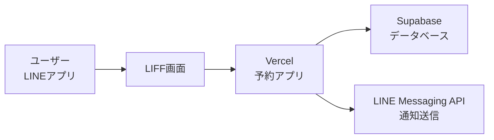
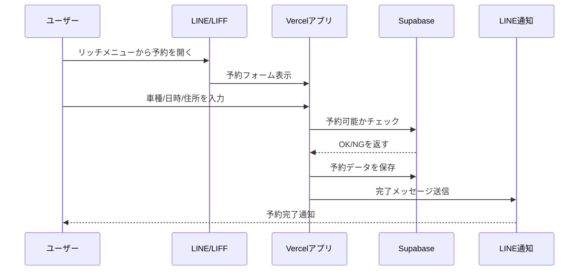
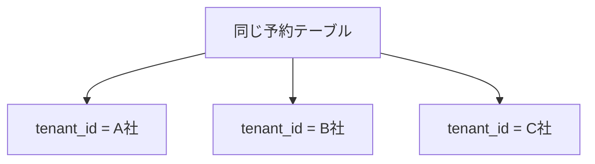
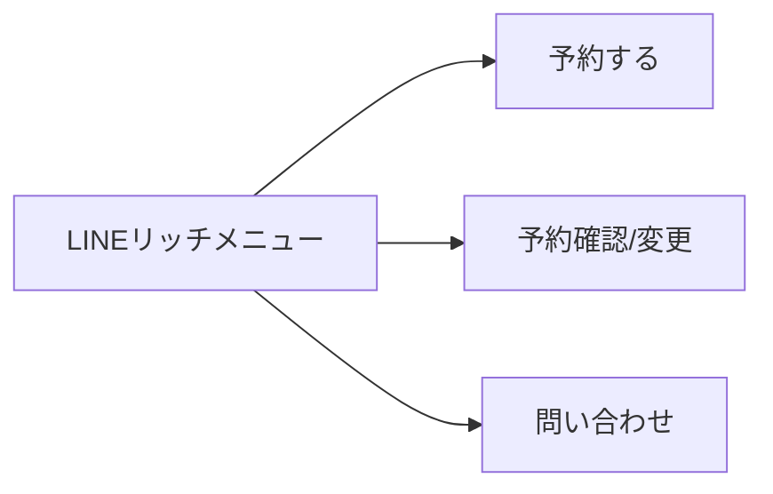
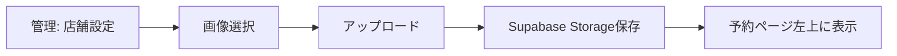
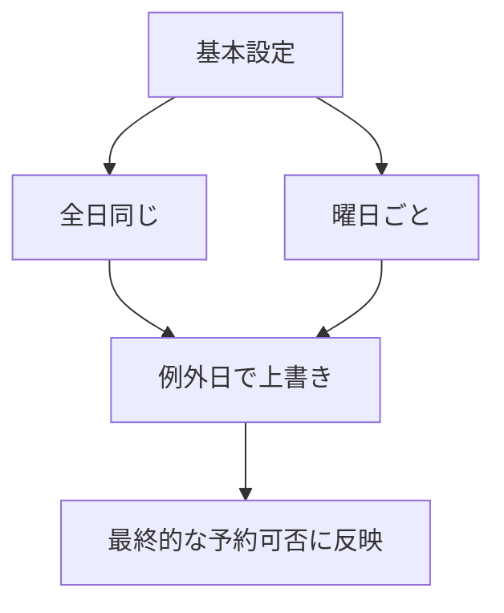
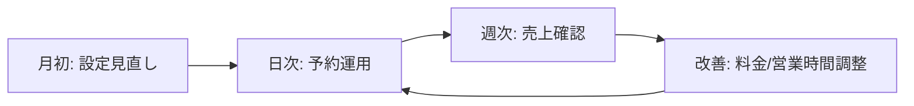

# 本アプリを企業へ提供する手順
## 完全初心者向けスライド原稿（PowerPoint用）

---

## スライド1: タイトル
**本アプリケーションを企業へ提供する際の手順**  
LINE（LIFF）× Supabase × Vercel  
初心者向け導入ガイド

**話すポイント**
- この資料は「コード未経験」の人向け
- 難しい用語はかみ砕いて説明
- 最終的に「企業に提供できる状態」までの流れを理解する

---

## スライド2: まず全体像（超ざっくり）
**3つのサービスが協力して動く**
- **LINE（LIFF）**: ユーザーの入口（予約画面を開く）
- **Vercel**: アプリを公開する場所（Webサーバー）
- **Supabase**: データベース（予約、顧客、設定を保存）



**話すポイント**
- LINEが「玄関」
- Vercelが「アプリ本体」
- Supabaseが「台帳（データ保管庫）」

---

## スライド3: 予約が入るときの流れ


**話すポイント**
- 予約前に「空きチェック」をしている
- 保存後にLINE通知（変更URL/キャンセルURL）を送っている

---

## スライド4: `tenant_id` の考え方（最重要）
**1つのアプリを複数企業で使うための「会社番号」**

- `tenant_id` = 企業を識別するID
- 同じテーブルでも、`tenant_id` が違えば別企業データとして扱う



**例**
- A社の管理画面ではA社の予約だけ表示
- B社の料金設定はB社だけに反映

---

## スライド5: なぜマルチテナントが便利か
- 企業ごとにアプリを作り直さなくてよい
- 保守が1つにまとまる（修正を全社へ横展開しやすい）
- 企業ごとの料金・営業時間・ロゴを分けられる

**注意点**
- `tenant_id` の付け忘れはデータ混在の原因
- 管理APIは必ず `tenant_id` で絞る

---

## スライド6: 提供までの全工程（ロードマップ）
```mermaid
flowchart TD
    P1[1. 事前準備] --> P2[2. 基盤セットアップ]
    P2 --> P3[3. 企業テナント作成]
    P3 --> P4[4. ユーザー導線設定<br/>(LIFF/リッチメニュー)]
    P4 --> P5[5. 管理ページ初期設定]
    P5 --> P6[6. 動作確認]
    P6 --> P7[7. 本番提供]
    P7 --> P8[8. 運用開始]
```

---

## スライド7: 事前準備（誰が何を用意するか）
**用意するアカウント**
- LINE Developers
- Supabase
- Vercel
- GitHub（推奨）

**企業からヒアリングする情報**
- 会社名（店舗名）
- ロゴ画像
- メニューと料金
- 営業時間（通常/曜日別/例外）
- 通知用LINE公式アカウント情報

---

## スライド8: 役割分担（非エンジニア向け）
| 役割 | 主な作業 |
|---|---|
| 導入担当 | 企業ヒアリング、設定投入、動作確認 |
| 管理者（企業側） | メニュー/営業時間/ロゴの更新 |
| システム担当 | 環境変数、デプロイ、障害対応 |

---

## スライド9: Supabase設定（初回）
**目的:** データの入れ物を準備する

手順:
1. Supabaseプロジェクト作成
2. SQL Editorでマイグレーション実行
   - `20260330_tenant_menus_scheduling.sql`
   - `20260329_tenant_logo.sql`
3. Storage bucket確認
   - `tenant-logos`（ロゴ用）

**確認ポイント**
- `tenants`, `service_menu_items`, `tenant_scheduling_settings` が存在
- `tenants.logo_path` カラムが存在

---

## スライド10: Vercel設定（初回）
**目的:** アプリを公開する

手順:
1. GitHub連携してVercelにプロジェクト作成
2. 環境変数を登録
3. Deploy実行

**主な環境変数**
- `NEXT_PUBLIC_SUPABASE_URL`
- `NEXT_PUBLIC_SUPABASE_ANON_KEY`
- `SUPABASE_URL`
- `SUPABASE_SERVICE_ROLE_KEY`
- `LINE_CHANNEL_ACCESS_TOKEN`
- `NEXT_PUBLIC_BASE_URL`
- `NEXT_PUBLIC_DEFAULT_TENANT_ID`

---

## スライド11: LINE（LIFF）設定（初回）
**目的:** LINE内から予約ページを開く

手順:
1. LINE Developersでチャネル作成
2. LIFFアプリを作成
3. LIFF URLに予約ページURLを設定
4. 必要ならWebhook/通知設定

**補足**
- ユーザーはLINE内から迷わず予約に入れる

---

## スライド12: リッチメニュー設定（企業提供時）
**目的:** ユーザー導線を分かりやすくする

推奨ボタン:
- 予約する（LIFF）
- 予約確認/変更（案内ページ）
- 問い合わせ先



---

## スライド13: 企業テナント作成（提供のたび）
**目的:** 企業ごとのデータ領域を準備

手順:
1. `tenants` に企業レコード作成
2. その `tenant_id` で初期データ登録
   - メニュー料金
   - 営業時間設定
3. （現在方式）対象環境の `NEXT_PUBLIC_DEFAULT_TENANT_ID` を合わせる

**将来像**
- ログイン連携で自動的に `tenant_id` 切替

---

## スライド14: 管理ページでの初期設定（企業担当者向け）
**ページ:** `/admin/settings`

設定項目:
- 店舗ロゴアップロード
- メニュー・料金
- 営業時間（全日/曜日別）
- 例外日（臨時休業/特別営業時間）
- 1台あたり作業時間
- 平均移動時間

---

## スライド15: ロゴ設定の手順（図解）


**ポイント**
- 画像は自動で枠内に収まる表示
- 推奨: 正方形 or 横長のロゴ

---

## スライド16: 営業時間設定の考え方（図解）


**ポイント**
- 基本設定 + 例外日で柔軟に運用
- 予約可否は「作業時間×台数 + 移動時間」で判断

---

## スライド17: ユーザーページの確認項目
**実際に確認すること**
- 予約ができる
- 営業時間外は適切にNGになる
- 変更URLで既存内容が表示される
- キャンセルURLでキャンセルできる
- 予約/変更/キャンセル通知がLINEに届く

---

## スライド18: 管理ページの確認項目
- 予約一覧が見える
- ステータス更新ができる
- 売上集計が見える
- ロゴ・メニュー・営業時間変更が反映される

---

## スライド19: 企業提供前チェックリスト（最終）
**システム**
- [ ] 本番URLでアクセス可能
- [ ] 環境変数がすべて設定済み
- [ ] DBマイグレーション適用済み
- [ ] Storage bucket確認済み

**運用**
- [ ] 企業ロゴ登録済み
- [ ] メニュー料金登録済み
- [ ] 営業時間/例外日登録済み
- [ ] リッチメニュー公開済み
- [ ] テスト予約で通知確認済み

---

## スライド20: よくあるトラブルと対処
1. **予約できない（RLSエラー）**
   - 症状: `42501`
   - 対処: 予約書き込みをサーバーAPI経由にする / ポリシー確認

2. **ロゴが壊れた画像になる**
   - 症状: 画像アイコンが崩れる
   - 対処: signed URL利用 / Storage権限確認 / bucket確認

3. **営業時間内なのに予約不可**
   - 対処: 作業時間・移動時間・例外日の設定を確認

---

## スライド21: 本番運用フロー（提供後）


---

## スライド22: セキュリティの基本（初心者向け）
- `service_role` キーは公開しない（サーバーのみ）
- 管理ページは認証を入れる（将来必須）
- 企業データは `tenant_id` で必ず分離
- 重要操作はAPIログを残す

---

## スライド23: 導入テンプレ（企業ごとにコピー）
**企業名:**  
**tenant_id:**  
**本番URL:**  
**LIFF ID:**  
**LINE公式アカウント:**  
**初期メニュー料金:**  
**営業時間設定:**  
**担当者連絡先:**  

---

## スライド24: まとめ
- 本システムは LINE + Vercel + Supabase の連携で動作
- `tenant_id` によって複数企業へ提供可能
- 提供時は「基盤設定 → 企業設定 → テスト → 提供」の順で進める
- 管理ページでロゴ・料金・営業時間を運用できる

---

## スライド25: 次アクション
1. まず1社分の「導入リハーサル」を実施
2. 本資料を企業向けに社名差し替え
3. チェックリスト運用を開始

---

## 付録A: PowerPoint化のコツ
- 1スライド1メッセージ
- 図はこの原稿のMermaidを参考にSmartArtで再作成
- 画面キャプチャを各設定スライドに追加すると理解度が上がる

## 付録B: 説明時の注意
- 「なぜ必要か」を毎回先に説明
- 用語は必ず言い換える（例: RLS = データの鍵）
- 最後に必ずテスト手順まで見せる

